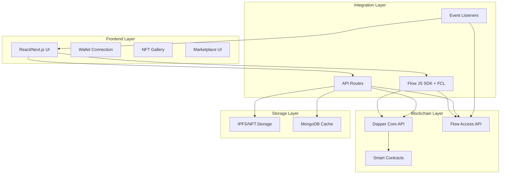
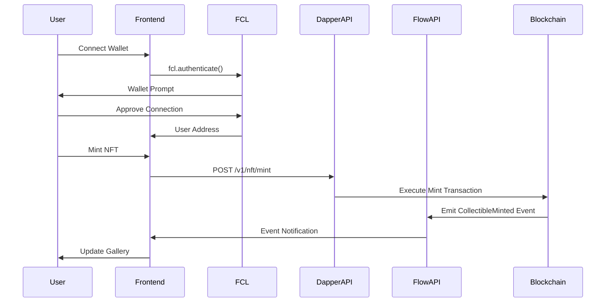

# Design Document

## Overview

This design document outlines the architecture for implementing Dapper Core API integration in Ownly, a Flow blockchain-powered NFT marketplace. The system will provide seamless wallet connectivity, NFT minting, marketplace operations, and real-time blockchain event monitoring while maintaining true decentralized ownership.

The architecture follows a layered approach with React/Next.js frontend, Flow JS SDK integration, Dapper Core API backend services, and Flow Access API for blockchain data queries.

## Architecture

### System Architecture Diagram



### Data Flow Architecture



## Components and Interfaces

### 1. Wallet Integration Component

**Purpose:** Handle Flow wallet connections using FCL and manage user authentication state.

**Key Interfaces:**
```typescript
interface WalletContextType {
  isConnected: boolean
  user: User | null
  flowUser: any | null
  address: string | null
  connect: () => Promise<void>
  disconnect: () => void
}

interface FlowUser {
  addr: string
  cid: string
  loggedIn: boolean
  services: FlowService[]
}
```

**Implementation Details:**
- Uses `@onflow/fcl` for wallet authentication
- Supports Dapper Wallet and Blocto Wallet
- Maintains connection state in React Context
- Handles wallet disconnection and session cleanup

### 2. NFT Minting Service

**Purpose:** Interface with Dapper Core API for minting new collectibles.

**Key Interfaces:**
```typescript
interface MintRequest {
  metadata_url: string
  recipient: string
  collection_id: "ownly_collectibles"
}

interface MintResponse {
  nft_id: string
  transaction_hash: string
  status: "pending" | "completed" | "failed"
}
```

**API Endpoint Design:**
```typescript
// POST /api/nft/mint
async function mintNFT(request: MintRequest): Promise<MintResponse> {
  // 1. Validate metadata_url and recipient address
  // 2. Call Dapper Core API POST /v1/nft/mint
  // 3. Return transaction details
  // 4. Set up event listener for completion
}
```

### 3. Marketplace Service

**Purpose:** Handle buying, selling, and listing operations through Flow transactions.

**Key Interfaces:**
```typescript
interface ListingRequest {
  nft_id: string
  price: number
  currency: "FLOW"
}

interface PurchaseRequest {
  nft_id: string
  buyer_address: string
}
```

**Flow Transaction Templates:**
```cadence
// Purchase Transaction
transaction(nftId: UInt64) {
  prepare(acct: AuthAccount) {
    DapperMarket.purchase(nftId: nftId, buyer: acct.address)
  }
}
```

### 4. Collection Query Service

**Purpose:** Fetch user's owned NFTs using Flow Access API.

**Key Interfaces:**
```typescript
interface CollectionQuery {
  address: string
}

interface NFTCollection {
  nft_ids: string[]
  metadata: NFTMetadata[]
}
```

**Cadence Script:**
```cadence
pub fun main(address: Address): [UInt64] {
  let collection = getAccount(address)
    .getCapability(/public/DapperCollection)
    .borrow<&{DapperCollectibles.CollectionPublic}>()
    ?? panic("Collection not found")
  return collection.getIDs()
}
```

### 5. Event Monitoring Service

**Purpose:** Listen for blockchain events and update UI in real-time.

**Key Interfaces:**
```typescript
interface EventListener {
  eventType: string
  contractAddress: string
  callback: (event: FlowEvent) => void
}

interface FlowEvent {
  type: string
  transactionId: string
  data: any
  blockHeight: number
}
```

**Implementation:**
```typescript
// Event subscription setup
fcl.events("A.<contractAddress>.DapperCollectibles.CollectibleMinted")
  .subscribe(event => {
    // Update UI with new mint
    updateGallery(event.data)
  })
```

## Data Models

### Core Data Types

```typescript
// Enhanced NFT interface for Ownly
interface OwnlyNFT {
  id: string
  name: string
  description: string
  image: string
  metadata_url: string
  owner: string
  creator: string
  collection_id: "ownly_collectibles"
  minted_at: string
  transaction_hash: string
  rarity?: string
  category?: string
}

// User profile with Flow integration
interface OwnlyUser {
  id: string
  flow_address: string
  username: string
  display_name: string
  avatar: string
  bio: string
  verified: boolean
  joined_at: string
  nfts_owned: number
  nfts_created: number
}

// Transaction tracking
interface OwnlyTransaction {
  id: string
  type: "mint" | "transfer" | "sale" | "listing"
  nft_id: string
  from_address?: string
  to_address?: string
  price?: number
  currency?: "FLOW"
  transaction_hash: string
  block_height: number
  timestamp: string
  status: "pending" | "completed" | "failed"
}
```

### Database Schema (MongoDB)

```typescript
// Collections for caching and fast queries
interface NFTCache {
  _id: string
  nft_id: string
  metadata: OwnlyNFT
  owner_address: string
  last_updated: Date
  block_height: number
}

interface UserCache {
  _id: string
  flow_address: string
  profile: OwnlyUser
  owned_nfts: string[]
  last_sync: Date
}

interface TransactionLog {
  _id: string
  transaction_hash: string
  event_type: string
  nft_id?: string
  addresses: string[]
  block_height: number
  processed: boolean
  created_at: Date
}
```

## Error Handling

### Error Categories and Responses

```typescript
// API Error Types
enum ErrorType {
  WALLET_NOT_CONNECTED = "WALLET_NOT_CONNECTED",
  INVALID_ADDRESS = "INVALID_ADDRESS",
  INSUFFICIENT_FUNDS = "INSUFFICIENT_FUNDS",
  NFT_NOT_FOUND = "NFT_NOT_FOUND",
  TRANSACTION_FAILED = "TRANSACTION_FAILED",
  API_ERROR = "API_ERROR",
  NETWORK_ERROR = "NETWORK_ERROR"
}

interface APIError {
  type: ErrorType
  message: string
  details?: any
  retry_after?: number
}
```

### Error Handling Strategies

1. **Wallet Connection Errors:**
   - Display user-friendly connection instructions
   - Provide retry mechanism with exponential backoff
   - Support multiple wallet options

2. **Transaction Failures:**
   - Show detailed error messages from Flow
   - Maintain UI state consistency
   - Provide transaction retry options

3. **API Timeouts:**
   - Implement circuit breaker pattern
   - Cache responses when possible
   - Graceful degradation for non-critical features

4. **Event Listener Failures:**
   - Automatic reconnection with backoff
   - Fallback to periodic polling
   - User notification for extended outages

## Testing Strategy

### Unit Testing

**Components to Test:**
- Wallet connection logic
- API service functions
- Event parsing and handling
- Data transformation utilities

**Testing Framework:** Jest + React Testing Library

```typescript
// Example test structure
describe('WalletService', () => {
  test('should connect to Dapper wallet', async () => {
    const mockFCL = jest.mocked(fcl)
    mockFCL.authenticate.mockResolvedValue(mockUser)
    
    const result = await walletService.connect()
    expect(result.address).toBe(mockUser.addr)
  })
})
```

### Integration Testing

**API Endpoint Testing:**
- Mock Dapper Core API responses
- Test error handling scenarios
- Validate request/response formats

**Flow Transaction Testing:**
- Use Flow Emulator for local testing
- Test transaction success/failure paths
- Validate event emission

### End-to-End Testing

**User Journey Testing:**
- Complete mint-to-sale workflow
- Wallet connection and disconnection
- Real-time event updates
- Cross-browser compatibility

**Tools:** Playwright or Cypress for E2E testing

### Performance Testing

**Load Testing:**
- API endpoint performance under load
- Event listener scalability
- Database query optimization

**Metrics to Monitor:**
- API response times
- Event processing latency
- UI rendering performance
- Memory usage patterns